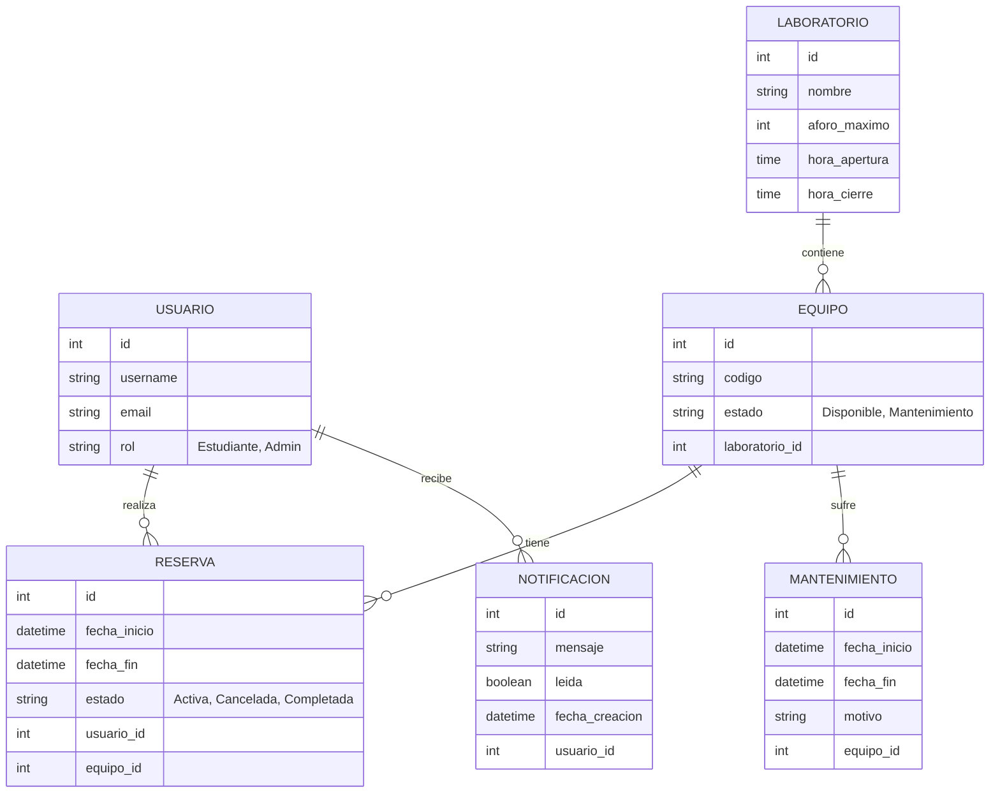

# Diagrama Entidad-Relación

```mermaid
erDiagram
    USUARIO ||--o{ RESERVA : realiza
    USUARIO ||--o{ NOTIFICACION : recibe
    LABORATORIO ||--o{ EQUIPO : contiene
    EQUIPO ||--o{ RESERVA : tiene
    EQUIPO ||--o{ MANTENIMIENTO : sufre

    USUARIO {
        int id
        string username
        string email
        string rol "Estudiante, Admin"
    }

    LABORATORIO {
        int id
        string nombre
        int aforo_maximo
        time hora_apertura
        time hora_cierre
    }

    EQUIPO {
        int id
        string codigo
        string estado "Disponible, Mantenimiento"
        int laboratorio_id
    }

    RESERVA {
        int id
        datetime fecha_inicio
        datetime fecha_fin
        string estado "Activa, Cancelada, Completada"
        int usuario_id
        int equipo_id
    }

    MANTENIMIENTO {
        int id
        datetime fecha_inicio
        datetime fecha_fin
        string motivo
        int equipo_id
    }

    NOTIFICACION {
        int id
        string mensaje
        boolean leida
        datetime fecha_creacion
        int usuario_id
    }
```
